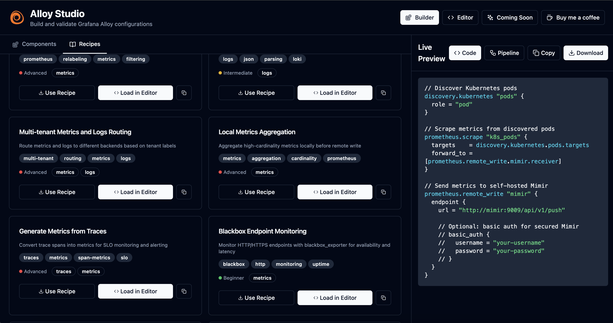

# Alloy Studio

[](https://github.com/simplyzee/alloy-studio/actions/workflows/deploy.yml)
[](https://opensource.org/licenses/MIT)

**Alloy Studio** is an open-source web application that helps engineers generate, validate, and understand Grafana Alloy configuration files. This tool simplifies the creation of observability pipelines by providing guided builders, validation, and comprehensive recipe templates.

<div align="center">

[](http://alloy-studio.simplyzee.dev/)

</div>



## ✨ Features

- **🎨 Dual Modes**: Switch between Guided Builder and Raw Editor
- **✅ Real-time Validation**: Validate configurations using the official Alloy CLI *Planned*
- **🎯 150+ Components**: Support for all Grafana Alloy components across 11 categories
- **📚 Recipe Library**: 30+ pre-built recipes for common observability patterns
- **💡 IntelliSense**: Smart autocomplete and syntax highlighting *Improvement Planned*
- **🎭 Dark Mode**: Beautiful dark theme by default
- **📦 Export Ready**: Download production-ready `.alloy` configuration files

## 🚀 Quick Start

### Using Docker Compose (Recommended)

```bash
# Clone the repository
git clone https://github.com/YOUR_USERNAME/alloy-studio.git
cd alloy-studio

# Start all services
docker-compose up

# Access the application
# Frontend: http://localhost:5173
# Backend API: http://localhost:8080
```

### Manual Setup

#### Frontend

```bash
cd frontend
npm install
npm run dev
```

#### Backend

```bash
cd backend
go mod download
go run cmd/server/main.go
```

**Note**: You'll need the [Grafana Alloy](https://grafana.com/docs/alloy/latest/get-started/install/) CLI installed for validation to work.

## 📖 Documentation

### Project Structure

```
alloy-studio/
├── frontend/          # React + TypeScript + Vite
│   ├── src/
│   │   ├── components/
│   │   │   ├── editor/     # Monaco editor & toolbar
│   │   │   ├── builder/    # Guided builder components
│   │   │   └── ui/         # shadcn/ui components
│   │   └── lib/
│   │       ├── api.ts      # API client
│   │       ├── store.ts    # Zustand state management
│   │       └── types.ts    # TypeScript types
│   └── ...
├── backend/           # Go + Fiber API
│   ├── cmd/server/    # Main application
│   ├── pkg/
│   │   ├── api/       # HTTP handlers
│   │   ├── validation/# Alloy validation logic
│   │   └── catalog/   # Component & recipe catalog
│   └── ...
└── docker/            # Docker configurations
```

### API Endpoints

#### `POST /api/validate`
Validate Alloy configuration using the Alloy CLI.

**Request:**
```json
{
  "config": "prometheus.scrape \"default\" { ... }",
  "stability_level": "stable",
  "enable_community_components": false
}
```

**Response:**
```json
{
  "valid": true,
  "errors": [],
  "warnings": []
}
```

#### `POST /api/format`
Format Alloy configuration.

**Request:**
```json
{
  "config": "prometheus.scrape \"default\" {...}"
}
```

**Response:**
```json
{
  "formatted_config": "prometheus.scrape \"default\" {\n  ...\n}"
}
```

#### `GET /api/components`
Get component catalog with optional filtering.

**Query Parameters:**
- `category`: Filter by category (e.g., "prometheus", "loki")
- `signal`: Filter by signal type (e.g., "metrics", "logs")
- `stability`: Filter by stability level
- `search`: Search by name/description

#### `GET /api/recipes`
Get recipe library with optional filtering.

**Query Parameters:**
- `category`: Recipe category
- `signal`: Signal type
- `difficulty`: Recipe difficulty level

## 🏗️ Architecture

### Frontend Stack
- **React 18** with TypeScript
- **Vite** for fast builds
- **Monaco Editor** for code editing
- **shadcn/ui** + Tailwind CSS for UI
- **Zustand** for state management
- **Lucide React** for icons

### Backend Stack
- **Go 1.22** with Fiber framework
- **Grafana Alloy CLI** for validation
- Embedded component and recipe catalogs

### Deployment
- **Frontend**: GitHub Pages (static site)
- **Backend**: Can be deployed to Railway, Render, Fly.io, or AWS Lambda

## 🎯 Component Categories

Alloy Studio supports all 150+ Grafana Alloy components:

- **beyla** - eBPF auto-instrumentation
- **database_observability** - Database monitoring
- **discovery** - Service discovery (30+ providers)
- **faro** - Frontend observability
- **local** - Local file operations
- **loki** - Log collection and processing (20+ components)
- **mimir** - Metrics management
- **otelcol** - OpenTelemetry Collector (70+ components)
- **prometheus** - Prometheus metrics (35+ components)
- **pyroscope** - Continuous profiling
- **remote** - Remote configuration

## 📚 Recipe Library

Pre-built recipes for common scenarios:

### Kubernetes Observability
- K8s Metrics to Mimir
- K8s Logs to Loki
- K8s Traces to Tempo
- Complete LGTM Stack

### Application Monitoring
- Node.js App Monitoring
- Go App Profiling
- Java App Telemetry

### Infrastructure Monitoring
- Linux Server Monitoring
- Windows Server Monitoring
- Docker Container Monitoring

### Database Monitoring
- MySQL Monitoring
- PostgreSQL Monitoring
- MongoDB Monitoring

...and many more!

## 🛠️ Development

### Prerequisites

- Node.js 20+
- Go 1.22+
- Docker & Docker Compose
- Grafana Alloy CLI (for validation)

### Install Dependencies

```bash
# Frontend
cd frontend && npm install

# Backend
cd backend && go mod download
```

### Run Tests

```bash
# Frontend
cd frontend && npm run lint && npm run build

# Backend
cd backend && go test ./...
```

### Build for Production

```bash
# Frontend
cd frontend && npm run build

# Backend
cd backend && go build -o server ./cmd/server
```

## 🤝 Contributing

Contributions are welcome! Please see [CONTRIBUTING.md](docs/CONTRIBUTING.md) for guidelines.

### Adding New Components

1. Add component definition to `backend/pkg/catalog/data/components.json`
2. Follow the schema defined in the spec
3. Test the component in the builder

### Adding New Recipes

1. Add recipe to `backend/pkg/catalog/data/recipes.json`
2. Test the generated configuration
3. Add documentation and troubleshooting tips

## 📝 License

This project is licensed under the MIT License - see the [LICENSE](LICENSE) file for details.

## 🙏 Acknowledgments

- [Grafana Alloy](https://grafana.com/docs/alloy/) - The amazing observability agent
- [shadcn/ui](https://ui.shadcn.com/) - Beautiful UI components
- [Monaco Editor](https://microsoft.github.io/monaco-editor/) - VS Code's editor

## 🔗 Links

- [Documentation](docs/)
- [GitHub Issues](https://github.com/simplyzee/alloy-studio/issues)
- [Grafana Alloy Docs](https://grafana.com/docs/alloy/)

---

Built with ❤️ for the observability community
